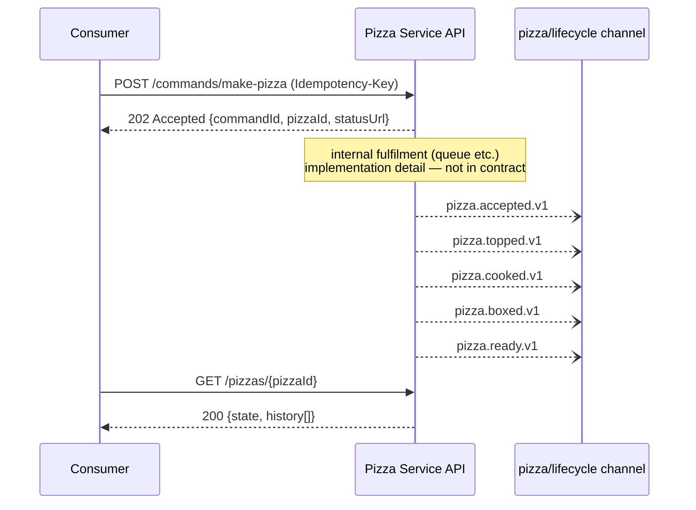
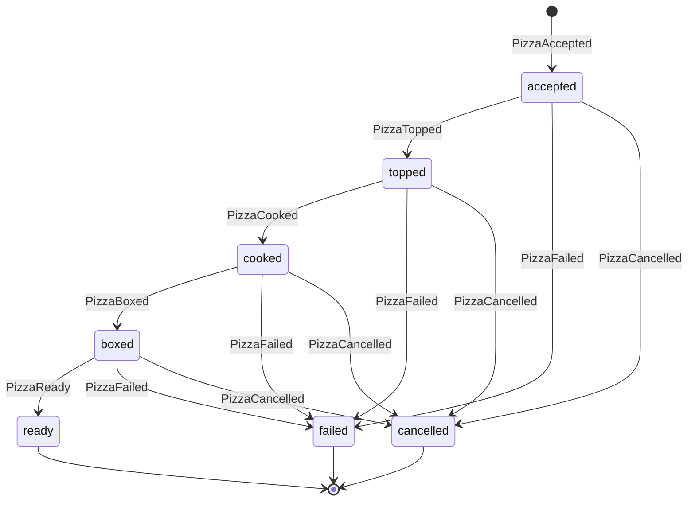
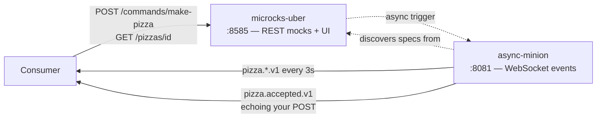

# pizza-pattern

Design-and-mock-first demonstrator for a command-driven, event-emitting service. A `MakePizza` **command** is posted over HTTP (not a pizza — the pizza doesn't exist yet), fulfilment is an internal concern, lifecycle events are emitted externally, and consumers can poll pizza status. **No internals are implemented** — the contracts and running mocks are the deliverable, so consumers can build against the service today.

- HTTP contract: [`specs/openapi.yaml`](specs/openapi.yaml) (OpenAPI 3.1)
- Event contract: [`specs/asyncapi.yaml`](specs/asyncapi.yaml) (AsyncAPI 2.6)
- Design decisions and challenges: [`docs/decisions.md`](docs/decisions.md)

## The design



Each lifecycle event marks entry into exactly one state — status is a projection of the event stream:



A `CancelPizza` command (`POST /commands/cancel-pizza`) moves any non-terminal pizza to `cancelled`; cancelling a terminal pizza returns `409`.

Every event shares an envelope carrying `pizzaId` (matches the HTTP response — the join key between the two worlds), `commandId` (causation) and a unique `eventId` (delivery is at-least-once; dedupe on it).

## Consumer quickstart — use the service now

Prerequisites: Docker, [go-task](https://taskfile.dev), Node 21+ (for the WebSocket smoke test), `jq`.

```sh
task mocks:up     # start Microcks + async minion
task mocks:load   # load both specs
task mocks:test   # smoke-test HTTP + events end-to-end
```

The mock topology:



### Call the HTTP mock

```sh
curl -i -X POST 'http://localhost:8585/rest/Pizza+Service+API/1.0.0/commands/make-pizza' \
  -H 'Content-Type: application/json' -H "Idempotency-Key: $(uuidgen)" \
  -d '{"size":"medium","crust":"sourdough","toppings":["mozzarella","basil"]}'
# HTTP/1.1 202 — {commandId, pizzaId, status, statusUrl}

curl 'http://localhost:8585/rest/Pizza+Service+API/1.0.0/pizzas/11111111-1111-1111-1111-111111111111'
# 200 — {state, order, history[]}
```

Any valid `size` returns the 202 example; an invalid one (try `"size": "banana"`) returns the 400 problem response, so you can exercise your error handling too.

The mock serves one fixture pizza frozen in each lifecycle state, so you can exercise every branch of your status handling:

| pizzaId | state |
| --- | --- |
| `11111111-1111-1111-1111-111111111111` | `accepted` — what the POST's `statusUrl` returns (read-your-writes) |
| `…112` | `topped` |
| `…113` | `cooked` |
| `…114` | `boxed` |
| `…115` | `ready` |
| `…116` | `failed` |
| `…117` | `cancelled` |
| any other id | `404` problem response |

Each carries the full `history` up to its state, and each is a distinct pizza from a distinct command (`commandId`s differ) so the fixtures respect the one-command-one-pizza contract.

Cancelling: `POST /commands/cancel-pizza` with `{"pizzaId": "…111"}` returns 202; any other `pizzaId` returns the 409 not-cancellable response.

Responses carry realistic simulated latency (~300ms on commands, ~150ms on status). Override per request with `?delay=<ms>` (e.g. `?delay=2000`) to test your timeout handling.

Ready-made requests for all of the above are in [`examples.http`](examples.http) (VS Code REST Client).

### Subscribe to the event mock

```sh
npx -y wscat -c 'ws://localhost:8081/api/ws/Pizza+Lifecycle+Events/1.0.0/pizza/lifecycle'
```

The full lifecycle (`pizza.accepted.v1` → … → `pizza.failed.v1`) replays every ~3 seconds. And it's live: keep wscat open, POST a `make-pizza` command from another terminal, and watch a `pizza.accepted.v1` arrive echoing your exact toppings. The authoritative WS URL is also shown on the operation page in the Microcks UI at <http://localhost:8585> — copy it from there if a hand-built URL 404s.

### Mock limitations (read before integrating)

The mock is example-driven and stateless, with one live exception: POSTing `make-pizza` **triggers a real contextualized `pizza.accepted.v1` event** on the WebSocket channel, echoing your actual order (`size`, `crust`, `toppings`) with a fresh `eventId` and timestamp. The `pizzaId`/`commandId` stay canonical (`…111`/`…222`) by design — they match what the 202 returns, preserving the correlation story. Caveats:

- Subscribe **before** you POST — the triggered event can arrive before the (deliberately delayed) 202 response.
- The trigger also fires on error responses: a 400 (e.g. `"size": "banana"`) emits a junk event with **empty** `pizzaId` — ignore events with empty `pizzaId`.
- `cancel-pizza` does **not** trigger an event (Microcks fires all contextualized messages per trigger, service-wide — see decisions.md).

Beyond the trigger, the ambient event stream is a fixed fixture that will not echo your ids: one canonical fixture pizza (`pizzaId 11111111-…111`) is used across *both* specs so the HTTP and event mocks correlate end-to-end. Idempotency is a contract promise, not enforced by the mock. The ambient stream replays its full example batch every ~3s with no ordering guarantee — order by `occurredAt`/state, not arrival. The `Location` header declared on the 202 is **not** served by the mock (use `statusUrl` from the body). Details in [`docs/decisions.md`](docs/decisions.md).

## Docs site

`task docs:serve` renders this README, the design decisions, and both API contracts (interactive Swagger UI for the HTTP API, generated AsyncAPI reference for the events) as a local MkDocs site at <http://localhost:8000>. `task docs:build` produces the static site in `site/` (build fails on broken links). The site is generated from the same spec files Microcks mocks from — no copies. Publishing is deferred while the repo is private.

## Tasks

| Task | What it does |
| --- | --- |
| `task lint` | Spectral-lint both specs |
| `task docs:serve` / `task docs:build` | Serve/build the MkDocs docs site |
| `task mocks:up` / `task mocks:down` | Start/stop the Microcks stack |
| `task mocks:load` | Load the specs into Microcks |
| `task mocks:test` | End-to-end smoke test (202, 200, one live event) |

## Troubleshooting the async mock

- Message examples in AsyncAPI 2.x **must have a `name`** — unnamed examples are silently ignored.
- The WebSocket binding must be on the **channel** (`bindings.ws`), not the operation — without it the operation registers as Kafka and no WS endpoint exists.
- In 2.x, `subscribe` = events the service publishes. A `publish` operation is invisible to the mock.
- If specs were loaded while the minion was starting, `docker compose -f mocks/docker-compose.yml restart async-minion` (already part of `task mocks:load`).
- The secondary examples artifact (`mocks/pizza-lifecycle-events.examples.yaml`) must be uploaded **after** `asyncapi.yaml` and **with `?mainArtifact=false`** — Microcks defaults `mainArtifact` to `true`, and a main-artifact upload of the examples file silently replaces the whole event service (wiping all fixture messages and the WS binding).
- Spaces in spec titles become `+` in every mock URL.
