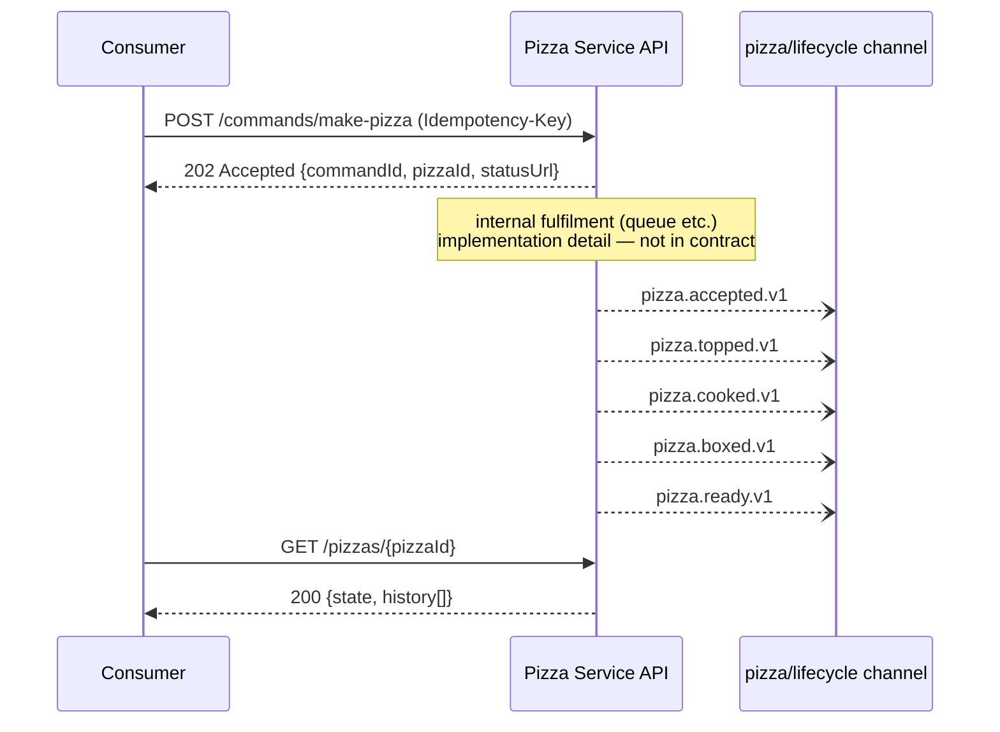
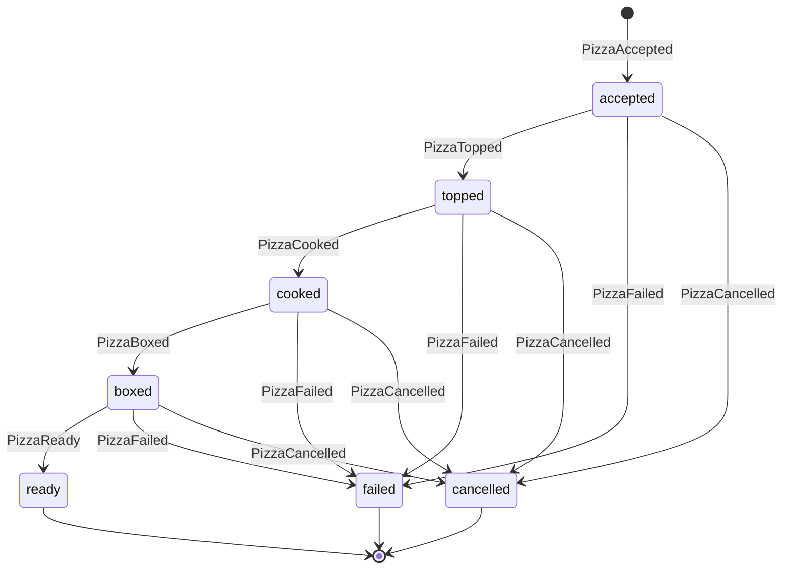

# pizza-pattern

Design-and-mock-first demonstrator for a command-driven, event-emitting service. A `MakePizza` **command** is posted over HTTP (not a pizza — the pizza doesn't exist yet), fulfilment is an internal concern, lifecycle events are emitted externally as CloudEvents, and consumers can poll pizza status. **No internals are implemented** — the contracts and running mocks are the deliverable, so consumers can build against the service today.

- HTTP contract: [`specs/openapi.yaml`](specs/openapi.yaml) (OpenAPI 3.1) — rendered under [API contracts](api/openapi.md)
- Event contract: [`specs/asyncapi.yaml`](specs/asyncapi.yaml) (AsyncAPI 2.6) — rendered under [API contracts](api/asyncapi.md)
- Try it now: the [consumer quickstart](quickstart.md)
- Why it's built this way: [design decisions](decisions.md)

## The design

Each lifecycle event marks entry into exactly one state — status is a projection of the event stream. This diagram is an illustration; the normative transition rules live in the [behaviour spec](behaviour.md):

A `CancelPizza` command (`POST /commands/cancel-pizza`) moves any non-terminal pizza to `cancelled`; cancelling a terminal pizza returns `409`.

Events are [CloudEvents 1.0](https://cloudevents.io/) (structured mode, JSON): `type` is reverse-DNS (`com.hungovercoders.pizza.accepted.v1` …), `subject` carries the pizza identity (matches the HTTP response `pizzaId` — the join key between the two worlds), the `commandid` extension attribute carries causation, and `id` is unique per event (delivery is at-least-once; dedupe on it).
