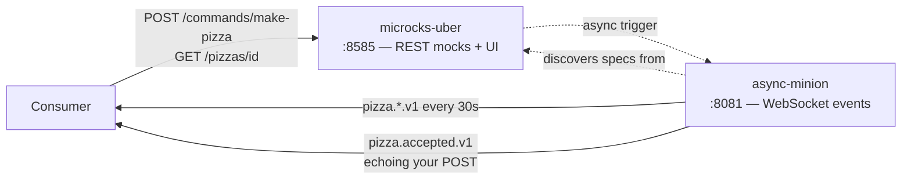

# Consumer quickstart — use the service now

Prerequisites: Docker, plus the toolchain from `mise install` (task, node, uv, jq — see the repo README).

```sh
task mocks:up        # start Microcks + async minion
task mocks:load      # load the specs and examples
task mocks:contract  # contract-test the mocks against the specs
task mocks:test      # smoke-test HTTP + events end-to-end
```

The mock topology:



## Call the HTTP mock

```sh
curl -i -X POST 'http://localhost:8585/rest/Pizza+Service+API/1.0.0/commands/make-pizza' \
  -H 'Content-Type: application/json' -H "Idempotency-Key: $(uuidgen)" \
  -d '{"size":"medium","crust":"sourdough","toppings":["mozzarella","basil"]}'
# HTTP/1.1 202 — {commandId, pizzaId, status, statusUrl}

curl 'http://localhost:8585/rest/Pizza+Service+API/1.0.0/pizzas/11111111-1111-1111-1111-111111111111'
# 200 — {state, order, history[]}
```

Any valid `size` returns the 202 example; an invalid one (try `"size": "banana"`) returns the 400 problem response, so you can exercise your error handling too.

The mock serves one fixture pizza frozen in each lifecycle state, so you can exercise every branch of your status handling:

| pizzaId | state |
| --- | --- |
| `11111111-1111-1111-1111-111111111111` | `accepted` — what the POST's `statusUrl` returns (read-your-writes) |
| `…112` | `topped` |
| `…113` | `cooked` |
| `…114` | `boxed` |
| `…115` | `ready` |
| `…116` | `failed` |
| `…117` | `cancelled` |
| any other id | `404` problem response |

Each carries the full `history` up to its state, and each is a distinct pizza from a distinct command (`commandId`s differ) so the fixtures respect the one-command-one-pizza contract.

Cancelling: `POST /commands/cancel-pizza` with `{"pizzaId": "…111"}` returns 202; any other `pizzaId` returns the 409 not-cancellable response.

Responses carry realistic simulated latency (~300ms on commands, ~150ms on status). Override per request with `?delay=<ms>` (e.g. `?delay=2000`) to test your timeout handling.

Ready-made requests for all of the above are in [`examples.http`](examples.http) (VS Code REST Client).

## Subscribe to the event mock

```sh
task mocks:watch    # wraps: npx -y wscat -c 'ws://localhost:8081/api/ws/Pizza+Lifecycle+Events/1.0.0/pizza/lifecycle'
```

The full lifecycle (`…pizza.accepted.v1` → … → `…pizza.failed.v1`) replays every ~30 seconds. And it's live: keep the watch open, run `task mocks:order TOPPING=your-name` from another terminal, and watch an accepted CloudEvent arrive echoing your exact topping. The authoritative WS URL is also shown on the operation page in the Microcks UI at <http://localhost:8585> — copy it from there if a hand-built URL 404s.

## Contract-test the mocks

```sh
task mocks:contract
```

Microcks doesn't only serve the mocks, it can also test an endpoint against a spec it holds — so this points that test runner back at the running mocks:

- the **OpenAPI runner** replays every request example in `specs/openapi.yaml` against the HTTP mock and validates each response against the schema for the status code it actually came back with (202, 400, 200, 404, 409);
- the **AsyncAPI runner** subscribes to the WebSocket channel for a full 45s window — long enough to catch a complete ~30s publication cycle — and validates every CloudEvent received against the message schemas in `specs/asyncapi.yaml`.

```text
contract test: Pizza Service API:1.0.0 [OPEN_API_SCHEMA] -> http://microcks:8080/rest/Pizza+Service+API/1.0.0
  PASS  POST /commands/make-pizza
        ok  margherita
  ...
contract ok: Pizza Service API:1.0.0 - <n> exchanges validated
```

Both endpoints are the in-network ones (`microcks:8080`, `async-minion:8081`), not the published `localhost` ports — the runner executes inside the stack, not on your machine. Full exchange-by-exchange detail, including the request and response bodies, is browsable afterwards in the Microcks UI at <http://localhost:8585> under **Tests** on each API.

This passes by construction today — the mock is generated from the same examples the runner replays — and that is the point: it is a regression test on the mock chain, and the same command with `REST_ENDPOINT`/`WS_ENDPOINT` overrides becomes the acceptance test for the real implementation — see [implementing the contract](implementing.md) and [design decisions](decisions.md#contract-tests-the-mock-is-the-first-implementation-under-test).

## Mock limitations (read before integrating)

The mock is example-driven and stateless, with one live exception: POSTing `make-pizza` **triggers a real contextualized accepted CloudEvent** on the WebSocket channel, echoing your actual order (`size`, `crust`, `toppings`) with a fresh `id` and `time`. The `subject`/`commandid` stay canonical (`…111`/`…222`) by design — they match what the 202 returns, preserving the correlation story. Caveats:

- Subscribe **before** you POST — the triggered event can arrive before the (deliberately delayed) 202 response.
- The trigger also fires on error responses: a 400 (e.g. `"size": "banana"`) emits a junk event with **empty** `subject` — ignore events with empty `subject`.
- `cancel-pizza` does **not** trigger an event (Microcks fires all contextualized messages per trigger, service-wide — see [design decisions](decisions.md)).

Beyond the trigger, the ambient event stream is a fixed fixture that will not echo your ids: one canonical fixture pizza (`pizzaId 11111111-…111`) is used across *both* specs so the HTTP and event mocks correlate end-to-end. Idempotency is a contract promise (stated normatively in the [behaviour spec](behaviour.md)), not enforced by the mock. The ambient stream replays its full example batch every ~30s with no ordering guarantee — order by `time`/state, not arrival. The `Location` header declared on the 202 is **not** served by the mock (use `statusUrl` from the body). Details in [design decisions](decisions.md).

## Tasks

| Task | What it does |
| --- | --- |
| `task setup` | One-shot onboarding: toolchain + git hooks |
| `task check` | Fast checks: branch name, spec lint, strict docs build (pre-commit hook) |
| `task check:commits` | All branch commits are conventional commits (also in CI) |
| `task ci` | Full verification — identical locally and in CI |
| `task lint` | Spectral-lint both specs + lint the Gherkin behaviour spec |
| `task docs:serve` / `task docs:build` | Serve/build the MkDocs docs site |
| `task mocks:up` / `task mocks:down` | Start/stop the Microcks stack |
| `task mocks:load` | Load the specs into Microcks |
| `task mocks:contract` | Contract-test the mocks against both specs (Microcks test runner) |
| `task mocks:test` | End-to-end smoke test |
| `task mocks:watch` | Subscribe to the lifecycle event channel |
| `task mocks:order TOPPING=x` | POST a MakePizza command (triggers a live event) |

## Troubleshooting the async mock

- Message examples in AsyncAPI 2.x **must have a `name`** — unnamed examples are silently ignored.
- The WebSocket binding must be on the **channel** (`bindings.ws`), not the operation — without it the operation registers as Kafka and no WS endpoint exists.
- In 2.x, `subscribe` = events the service publishes. A `publish` operation is invisible to the mock.
- If specs were loaded while the minion was starting, `docker compose -f mocks/docker-compose.yml restart async-minion` (already part of `task mocks:load`).
- The secondary examples artifact (`mocks/pizza-lifecycle-events.examples.yaml`) must be uploaded **after** `asyncapi.yaml` and **with `?mainArtifact=false`** — Microcks defaults `mainArtifact` to `true`, and a main-artifact upload of the examples file silently replaces the whole event service (wiping all fixture messages and the WS binding).
- Spaces in spec titles become `+` in every mock URL.
